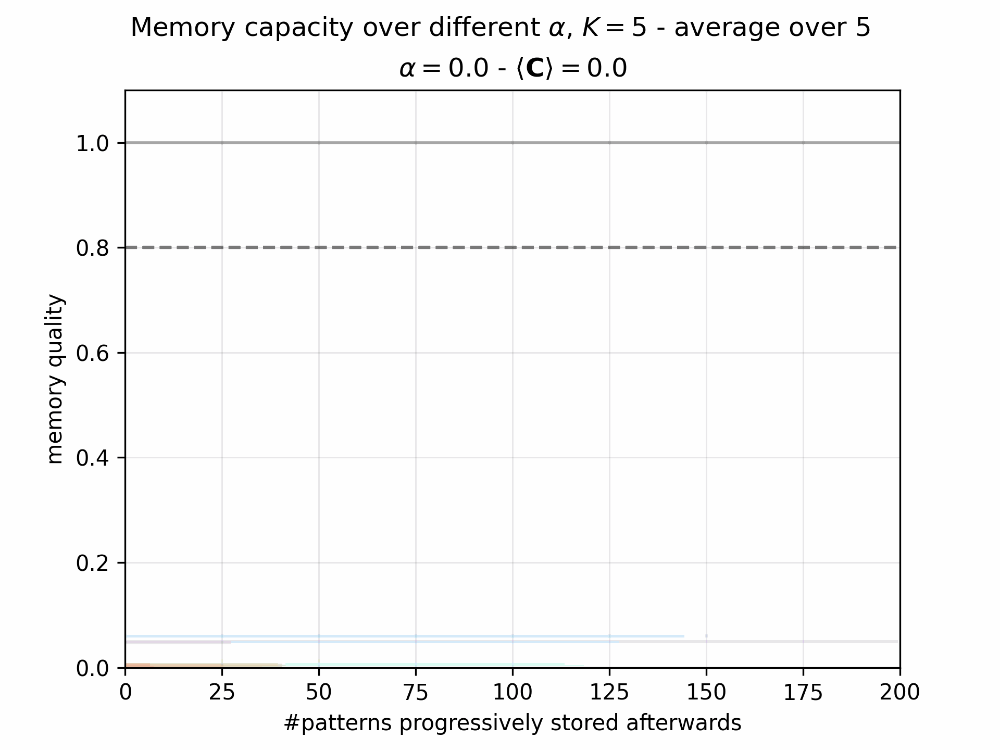

# KAMemory

#### Goal
---
Q1: *how can EC readout remain stable while BTSP is occurring on CA3-CA1 synapses?*

#### Results

Dependance of the memory capacity on the learning rate ($\alpha$)

**parameter search**
see https://wandb.ai/ikiru-university-of-oslo/kam_2/sweeps/tc96txc8?nw=nwuserikiru

#### TODO

- [x] **Make the neural spaces homogenous**
	- [x] sparse inputs
	- [x] implement *sparsemax*
	- [x] just $x_{CA3}$  (activation) \[sparsify CA3 output\]
	- [x] Autoencoder : look into the sparsemax
	- [x] visualize sparsity effect

- [x] **load a pre-train AE and stimuli**
- [x] **grid-search**

- [x] check bias

**speedup tricks** *>>> tried*
- [ ] test every past patterns each time a new pattern is learnt

**memory capacity**
- [ ] chance level threshold

**parameter search**
parameters:
- $K_{\text{lat}}$
- $K_{\text{CA3}}$
- $\beta$
- $\alpha$

#### Biblography
---
- Schapiro, A. C., Turk-Browne, N. B., Botvinick, M. M., & Norman, K. A. (2017). Complementary learning systems within the hippocampus: a neural network modelling approach to reconciling episodic memory with statistical learning. Philosophical Transactions of the Royal Society B: Biological Sciences, 372(1711), 20160049.
- Pang, R., & Recanatesi, S. (2024). A non-Hebbian code for episodic memory. bioRxiv, 2024-02.

