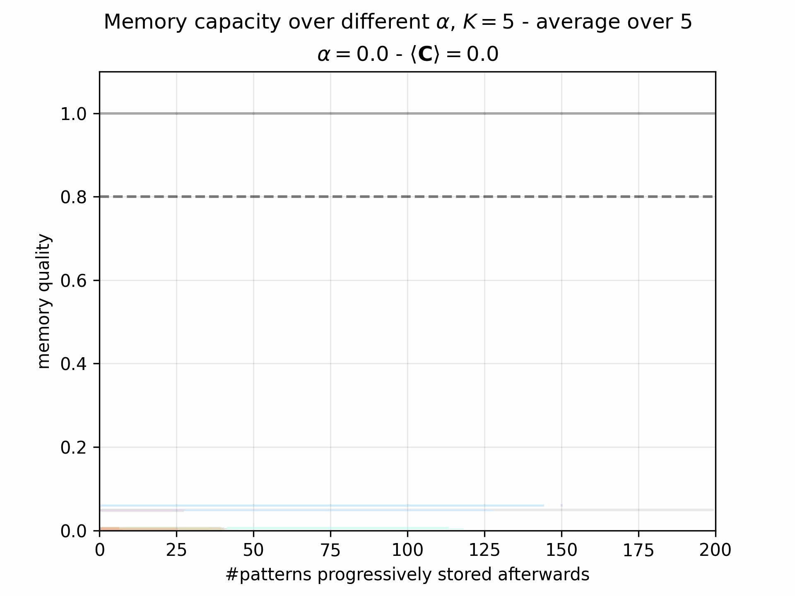

# KAMemory

new project repository at git@github.com:iKiru-hub/kam.git

## Backend

The reusable simulation backend lives in `src/kamemory`. Models, data
generation, training loops, and file handling are independent of notebooks and
plotting code. The older flat modules in `src/` remain available temporarily for
the exact notebook-parity tests. New experiments must import only `kamemory`.

The active project tree is:

```text
src/
├── kamemory/       # canonical models, plasticity, data, training, and persistence
├── experiments/    # headless E0, E1, ... experiment entry points
│   └── plots/      # figures, JSON summaries, and compressed source data
├── configs/        # validated model configurations
├── data/           # canonical named autoencoder checkpoints
├── models.py       # legacy parity reference; do not extend
├── training.py     # legacy parity reference; do not extend
└── utils.py        # legacy parity reference; do not extend
tests/
├── test_backend.py
├── test_legacy_parity.py
├── test_e2_metrics.py
├── test_track_protocol.py  # factorial task and legacy remapping parity
├── test_e4_protocol.py
├── test_e5_interference.py
├── test_e6_mixed_selectivity.py
├── test_e7_data_comparison.py
├── test_plasticity_rules.py
└── test_e9_heterogeneity.py
```

Install the package in editable mode:

```bash
python3 -m venv .venv/kamvenv
source .venv/kamvenv/bin/activate
python3 -m pip install -r requirements.txt
python3 -m pip install -e .
```

Run the fast path, checkpoint, and training diagnostics before a simulation:

```bash
python3 -m kamemory.checks
```

Without installing, the equivalent command is:

```bash
PYTHONPATH=src python3 -m kamemory.checks
```

### Retraining the factorial-track autoencoder

The paper's CA1-track experiments (E3, E6, E7, and E9) use concatenated
MEC-like spatial activity and LEC-like sparse sensory input. Retrain the
100→1000→100 autoencoder on that exact factorial-track distribution with:

```bash
python3 src/train_autoencoder.py --name ae_factorial_01
```

The default settings are in `src/configs/autoencoder_factorial.json`. Common
terminal overrides do not require editing that file:

```bash
python3 src/train_autoencoder.py \
  --seed 9 --epochs 400 --lr 0.0005 --batch-size 256 \
  --device cpu --name ae_factorial_seed9
```

The trainer creates independent training, validation, and held-out test
sessions with the same `generate_factorial_track` function used downstream.
It restores the best validation epoch, reports separate spatial and sensory
metrics, compares the result with `ae_6`, and saves `autoencoder.pt` plus full
provenance in `info.json`. Saved sessions are directly compatible with the
existing loader and experiment flags:

```python
from kamemory import load_autoencoder_session, run_autoencoder_experiment

result = run_autoencoder_experiment({
    "seed": 9,
    "epochs": 100,
    "lr": 5e-4,
    "batch_size": 256,
    "save_name": "ae_factorial_seed9",
})

info, autoencoder = load_autoencoder_session(result["session_path"])
```

For all settings, copy and edit the JSON configuration or pass another file
with `--config`. A new checkpoint is an intentional model change: supply it to
downstream scripts with, for example,
`python3 src/experiments/04_ca1_track.py --checkpoint ae_factorial_01`, then
regenerate dependent results rather than mixing old arrays with new weights.

Run the definitive validated experiments with:

```bash
python3 src/experiments/00_model_validation.py --deterministic
python3 src/experiments/01_alignment.py --deterministic
python3 src/experiments/02_retention.py --deterministic
python3 src/experiments/03_degraded_cues.py --deterministic
python3 src/experiments/04_ca1_track.py --deterministic
python3 src/experiments/04b_legacy_remapping.py --deterministic
python3 src/experiments/05_sensitivity.py --deterministic
python3 src/experiments/06_interference_analysis.py --deterministic
python3 src/experiments/07_ca1_mixed_selectivity.py --deterministic
python3 src/experiments/08_ca1_data_comparison.py
python3 src/experiments/09_rule_baselines.py --deterministic
python3 src/experiments/10_is_heterogeneity.py --deterministic
```

These commands regenerate raw data and figures from scratch. They never read
cached notebook panels. `04b_legacy_remapping.py` is the backward-compatible
E3 companion: it recreates the old one-cue-at-positions-10-and-30 simulation
and figures, while `04_ca1_track.py` is the definitive factorial causal test.
`05_sensitivity.py` reads the frozen optimized configuration from
`src/configs/optimized_memory.json` and tests its neighborhood without running
a new optimizer. `06_interference_analysis.py` unrolls the learning rule to
explain E2 forgetting through exact synaptic trace survival and crosstalk.
`07_ca1_mixed_selectivity.py` replays E3 bit-for-bit, classifies factorial CA1
response types using training laps, and evaluates their effects and remapping
on held-out laps. `08_ca1_data_comparison.py` compares the E6 cue–position
population association with an exact published CA1 odor–place contingency;
the prespecified empirical profile is stored in
`src/experiments/reference_data/`. `09_rule_baselines.py` uses disjoint
development and held-out seeds to compare the validated target-gated update
with bounded Hebbian and local delta-rule storage, while repeating the
alignment and matched-decoder controls for every rule.
`10_is_heterogeneity.py` uses 20 fresh paired seeds to test whether
cue-independent, randomly matched background plateau events can correct the
E7 cue–spatial overcoupling while preserving the stable EC readout. It reports
the complete frozen sweep and its negative result; no event rate is selected
post hoc.

The rewritten memory API separates storage from retrieval:

```python
from kamemory import BTSPMemory, store_patterns

store_patterns(memory, training_patterns)  # changes CA3->CA1 weights
outputs = memory(test_pattern)              # retrieval only; no learning
```

#### Goal
---
Q1: *how can EC readout remain stable while BTSP is occurring on CA3-CA1 synapses?*


#### Results


Dependance of the memory capacity on the learning rate ($\alpha$)



**parameter search**
see https://wandb.ai/ikiru-university-of-oslo/kam_2/sweeps/tc96txc8?nw=nwuserikiru


#### TODO

- [x] **Make the neural spaces homogenous**
	- [x] sparse inputs
	- [x] implement *sparsemax*
	- [x] just $x_{CA3}$  (activation) \[sparsify CA3 output\]
	- [x] Autoencoder : look into the sparsemax
	- [x] visualize sparsity effect

- [x] **load a pre-train AE and stimuli**
- [x] **grid-search**


- [x] check bias

**speedup tricks** *>>> tried*
- [ ] test every past patterns each time a new pattern is learnt

**memory capacity**
- [ ] chance level threshold

**parameter search**
parameters:
- $K_{\text{lat}}$
- $K_{\text{CA3}}$
- $\beta$
- $\alpha$


#### Biblography
---
- Schapiro, A. C., Turk-Browne, N. B., Botvinick, M. M., & Norman, K. A. (2017). Complementary learning systems within the hippocampus: a neural network modelling approach to reconciling episodic memory with statistical learning. Philosophical Transactions of the Royal Society B: Biological Sciences, 372(1711), 20160049.
- Pang, R., & Recanatesi, S. (2024). A non-Hebbian code for episodic memory. bioRxiv, 2024-02.
